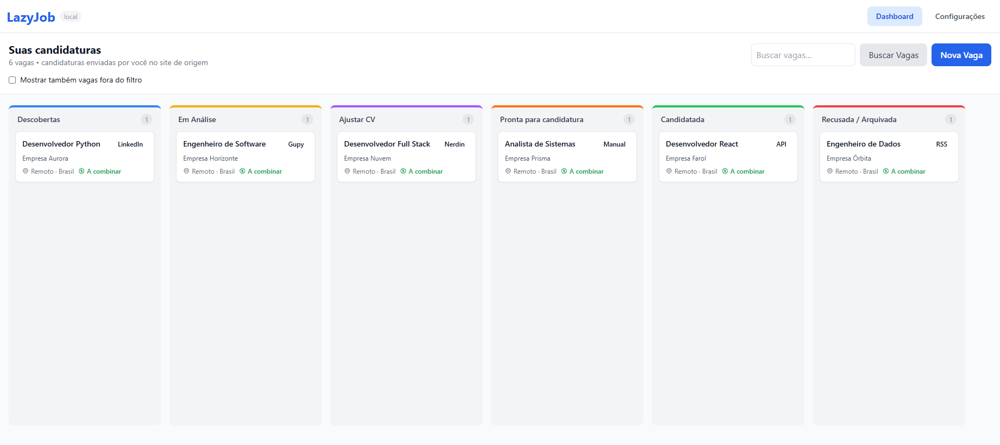
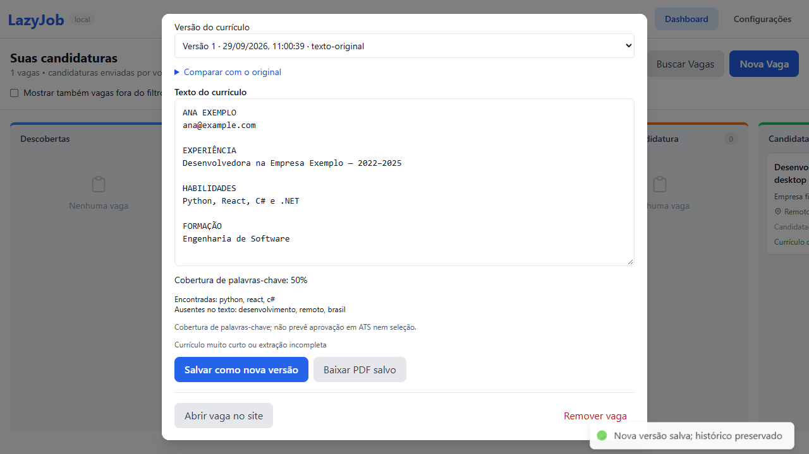

# LazyJob

Gerenciador local de oportunidades de trabalho e currículos. Organize vagas em um Kanban, revise um currículo por oportunidade e registre candidaturas enviadas por você no site de origem.

**React · TypeScript · Express · Prisma · SQLite · Playwright**

| Kanban de oportunidades | Revisão e versões do currículo |
| --- | --- |
|  |  |

As capturas mostram somente vagas e currículo fictícios. A segunda foi gerada pelo teste de ponta a ponta em 29/09/2026.

## Problema de negócio

Buscar vagas em várias fontes, acompanhar o andamento de cada candidatura e adaptar o currículo são tarefas separadas e repetitivas. Sem um histórico local, é fácil perder contexto sobre a vaga, o documento enviado e a etapa seguinte.

## Solução e fluxo

O LazyJob reúne oportunidades em um Kanban de seis etapas. O usuário pode cadastrar vagas manualmente, consultar fontes configuradas, revisar a adequação do currículo a cada descrição e gerar versões em PDF. A candidatura continua sendo feita pela própria pessoa no site de origem; o LazyJob registra o andamento depois.

```text
Vaga manual ou coleta configurada → triagem → Kanban
                                            ↓
Currículo-base → revisão por vaga → PDF versionado → candidatura no portal → registro da etapa
```

## Arquitetura

| Parte | Responsabilidade |
| --- | --- |
| React, TypeScript e Vite | Interface de Kanban, configurações e revisão de currículo |
| Express | API HTTP local e distribuição da interface compilada |
| Prisma e SQLite | Vagas, configurações, histórico e versões no computador do usuário |
| Playwright | Coleta assistida de portais e testes de navegador |
| pdf-lib | PDFs de currículo com fonte incorporada |

O backend escuta apenas `127.0.0.1`, e o aplicativo é destinado a uma pessoa em um computador. O projeto mantém o frontend e o backend em pastas separadas, com lockfiles próprios. A geração de PDFs preserva versões anteriores para consulta.

## Recursos

- Cadastro manual, pesquisa, notas e seis etapas de acompanhamento.
- Coleta assistida em LinkedIn, Gupy, Nerdin, Indeed e Glassdoor, além de RSS/Atom e APIs JSON configuradas.
- Deduplicação e histórico de coleta com falhas por fonte.
- Triagem de vagas de TI remotas elegíveis no Brasil. Dados ambíguos ficam pendentes; vagas excluídas podem ser exibidas.
- Currículo-base por texto revisado ou PDF com texto selecionável.
- PDFs A4 com fonte incorporada, paginação e versões imutáveis.
- IA opcional para **reordenar seções existentes**, preservando fatos e contatos. Se a IA falhar, o texto original é mantido.
- Mudança de etapa por teclado/celular, além de arrastar cartões.

Não envia candidaturas nem acessa contas dos portais. A cobertura de palavras-chave compara textos e não prevê aprovação em ATS.

## Instalação

Requer **Node.js 22.12 ou superior**, npm e Git. Funciona em Windows, Linux e macOS. A primeira instalação requer internet.

```sh
git clone https://github.com/EdwinNRM/LazyJob.git
cd LazyJob
npm run setup
npm start
```

Abra **http://127.0.0.1:3001**. O backend serve a interface compilada, usando apenas um processo.

O setup instala os lockfiles, aplica migrações, cria configurações ausentes e compila a aplicação. Não redefine configurações existentes. Antes de atualizar, pare o servidor e faça backup de `backend/prisma/dev.db` e `backend/generated-cvs/`.

Para coleta em sites e testes de navegador:

```sh
npm run browser:install
```

Se o download do Chromium estiver indisponível no Windows, use o Edge instalado:

```powershell
$env:PLAYWRIGHT_CHANNEL = "msedge"
npm start
```

Cadastro manual, RSS/API e PDFs funcionam sem navegador adicional ou modelo de IA.

## Primeiro uso

1. Em **Configurações**, cole o texto do currículo, revise e salve. Opcionalmente, informe o caminho absoluto de um PDF e use **Extrair do PDF**.
2. Escolha termos, localizações e fontes usando listas JSON, como `["Python", "React"]`.
3. Use **Nova Vaga** ou **Buscar Vagas**. Abra os detalhes da última coleta para consultar erros.
4. Abra uma vaga e selecione **Ajustar CV**, ou clique em **Gerar nova versão**. Acrescente a descrição completa quando o portal não a fornecer.
5. Revise, salve uma nova versão e baixe o PDF salvo. O seletor permite consultar versões anteriores.
6. Abra a vaga no site, candidate-se e registre a etapa **Candidatada**.

O texto revisado tem prioridade sobre o PDF. Ao trocar de arquivo, extraia e salve novamente ou limpe o texto revisado. PDFs digitalizados exigem transcrição/OCR externo. Caracteres não suportados pela fonte geram um erro explícito.

## Fontes e limites

Portais podem mudar ou bloquear acesso automatizado. O LazyJob informa falhas e mantém o cadastro manual disponível. Coletas sem anúncios legíveis geram aviso, pois podem indicar busca vazia ou mudança no site.

Em uma verificação anterior, em **24/09/2026**, LinkedIn, Gupy e Nerdin retornaram anúncios; Indeed e Glassdoor responderam HTTP 403. Esses resultados são históricos, não garantem a disponibilidade atual dos portais e não substituem a revisão humana.

RSS/Atom e APIs só consultam URLs configuradas; não há catálogo embutido. RSS aceita título, link, descrição e autor. A API aceita uma lista ou `{ "jobs": [...] }` / `{ "data": [...] }`:

```json
{
  "title": "Desenvolvedor Python",
  "company": { "name": "Empresa Exemplo" },
  "url": "https://example.com/vagas/123",
  "description": "Trabalho remoto, contratação em todo o Brasil.",
  "location": "Remoto Brasil",
  "published_at": "2026-09-24T12:00:00Z"
}
```

Links devem ser HTTP/HTTPS; datas inválidas são ignoradas. A triagem exige evidência de elegibilidade no Brasil, América Latina ou contratação mundial. Apenas “remote” não basta. A classificação é heurística e deve ser revisada. Feeds importam as listagens da URL; os termos de busca são usados pelos coletores de portais.

O agendador roda às **06h e 18h, America/Sao_Paulo**, enquanto o servidor estiver aberto. Há uma coleta por vez. No reinício, trabalhos interrompidos ficam disponíveis para nova tentativa.

## Dados e configuração

Aplicação de usuário único para localhost, sem login. O servidor escuta apenas `127.0.0.1` e rejeita origens/hosts externos. Não foi projetado para publicação na internet ou vários processos no mesmo banco.

Banco, chaves e PDFs ficam no computador e não são versionados. As chaves no SQLite não são criptografadas. Com OpenAI ou Anthropic, a geração envia currículo e descrição ao provedor. Ollama usa o endpoint configurado. Novas instalações começam sem IA.

Variáveis opcionais, definidas no shell:

| Variável | Padrão / finalidade |
| --- | --- |
| `PORT` | `3001` |
| `DATABASE_URL` | `file:./dev.db`, relativo a `backend/prisma` |
| `CV_OUTPUT_DIR` | `backend/generated-cvs` com `npm start` |
| `DISABLE_SCHEDULER` | `1` desativa agendamento |
| `PLAYWRIGHT_CHANNEL` | `msedge` ou `chrome` para navegador instalado |
| `VITE_API_TARGET` | Proxy dev: `http://127.0.0.1:3001` |

## Desenvolvimento e testes

```sh
npm run build
npm test
npm run test:e2e
```

Testes HTTP usam SQLite temporário e feeds simulados. Testes de navegador usam banco próprio, porta **4317**, desktop e celular. Nenhum teste envia candidaturas ou usa currículo pessoal.

Para recarga automática, execute em dois terminais:

```sh
npm --prefix backend run dev
npm --prefix frontend run dev
```

Abra `http://localhost:5173`. Após alterar o código, execute `npm run build` para atualizar a interface de `npm start`.

Em **29/09/2026**, `npm run build` compilou backend e frontend, **47 testes de backend** e **10 testes de frontend** passaram. Com o Microsoft Edge instalado, **4 testes de navegador** passaram em desktop e celular, cobrindo configuração, cadastro, geração e versionamento de PDF, etapas de candidatura e estados de erro. Os testes usam banco temporário, vagas fictícias e currículo fictício; não enviam candidaturas. Esta execução não repetiu consultas reais aos portais externos nem usou provedores de IA.

Noto Sans usa a [SIL Open Font License](backend/assets/fonts/LICENSE).
